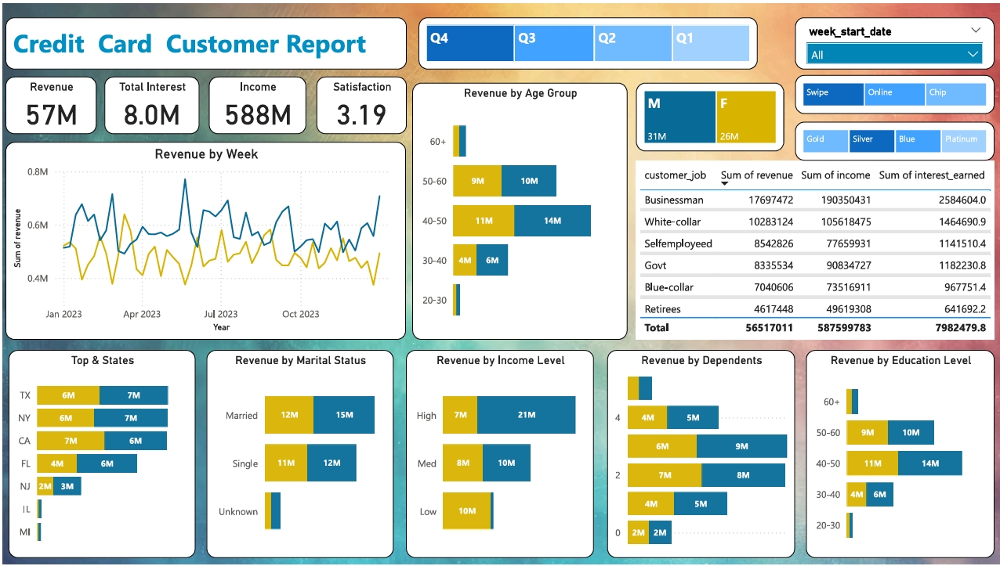
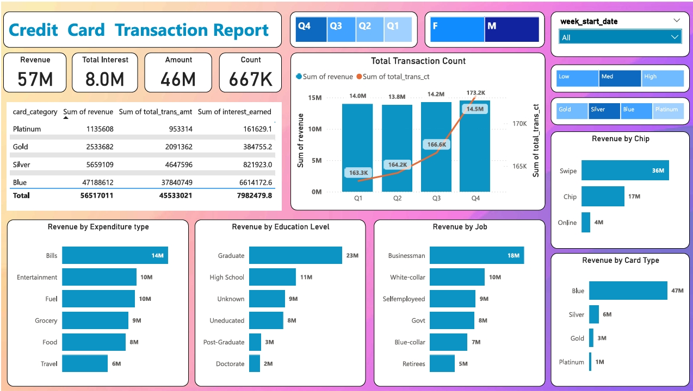

# **Credit Card Transaction & Customer Analysis Dashboard**

## **Project Overview**
This project focuses on developing a **comprehensive Power BI dashboard** for analyzing **credit card transactions** and **customer behavior** using real-time data stored in a **PostgreSQL database**. The dashboard provides insights into key financial metrics, transaction trends, and customer demographics, enabling stakeholders to make informed decisions.

---

## **Table of Contents**
- [Project Workflow](#project-workflow)
- [Dataset Information](#dataset-information)
- [Dashboard Overview](#dashboard-overview)
- [Technologies Used](#technologies-used)
- [Setup and Installation](#setup-and-installation)
- [Power BI Dashboard](#power-bi-dashboard)
- [Insights and Key Findings](#insights-and-key-findings)
- [Contributors](#contributors)
- [License](#license)

---

## **Project Workflow**
1. **Data Source**  
   - Two CSV files are used as input:
     - **Credit Card Transactions (`cc_data.csv`)**
     - **Customer Data (`customer_data.csv`)**
  
2. **Data Storage**  
   - The CSV data is imported into **PostgreSQL**.
   - Two separate tables are created in **PostgreSQL**:
     - `credit_card_transactions`
     - `customer_details`

3. **Data Connection to Power BI**  
   - PostgreSQL is connected to **Power BI** for visualization.
   - Data transformation and modeling are done in Power BI.

4. **Dashboard Development**  
   - Two dashboards are created:
     - **Credit Card Customer Report**
     - **Credit Card Transaction Report**
   - KPIs and insights are displayed visually.

---

## **Dataset Information**
- **`cc_data.csv` (Transaction Data)**
  - Contains transaction details such as revenue, transaction amount, card type, expenditure type, and more.
  
- **`customer_data.csv` (Customer Data)**
  - Includes demographic details such as income level, job type, marital status, and transaction behavior.

---

## **Dashboard Overview**
### **1. Credit Card Customer Report**  
Provides insights into customer revenue contribution, income level, education level, and spending behavior.



### **2. Credit Card Transaction Report**  
Focuses on transaction distribution by card type, expenditure type, and quarterly trends.



---

## **Technologies Used**
- **Database**: PostgreSQL  
- **Data Processing**: Pandas (Python)  
- **Visualization**: Power BI  
- **Data Storage**: CSV  
- **Version Control**: Git & GitHub  

---

## **Setup and Installation**
### **1. Clone the Repository**
```bash
git clone https://github.com/your-github-username/your-repo-name.git
cd your-repo-name
